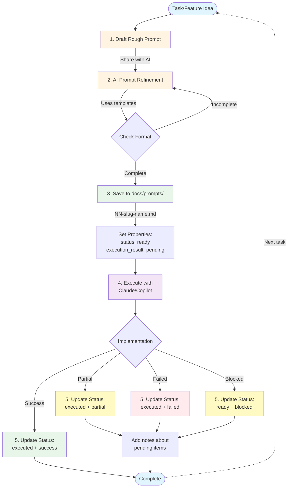

# AI-Assisted Development Workflow

This document describes the standardized AI-assisted development workflow used throughout the borg-clone job board Turborepo project. This workflow leverages Obsidian as a knowledge base and AI agents (Claude, GitHub Copilot) for prompt refinement and code execution.

---

## Overview

The workflow is designed to maintain structured, traceable, and well-documented development steps while leveraging AI capabilities for both planning and implementation. All documentation is stored in an Obsidian vault (`docs/`) that serves as the project's central knowledge base.

---

## Workflow Visualization



---

## Workflow Steps

### 1. **Draft Initial Prompt**

Write a rough prompt describing the task or feature to be implemented. This initial draft should:

- Clearly state the goal or objective
- Reference relevant context files (specs, planning docs, existing code)
- Include any constraints or requirements
- Be conversational and may contain incomplete thoughts

**Location**: Draft locally or in a temporary file

**Example**: "I need to add authentication to the backend API. Should use JWT tokens and store user data. Check the auth-db package for schema. Make sure it works with the existing NestJS setup."

---

### 2. **AI Prompt Refinement**

Use an AI assistant (Claude, ChatGPT, etc.) to refine the rough prompt into a well-structured, comprehensive prompt document.

**Process**:
1. Share the rough draft with AI
2. Provide context about the project structure
3. Reference the prompt template and header reference:
   - [template-prompt.md](prompts/template-prompt.md)
   - [00-prompt-header-reference.md](prompts/00-prompt-header-reference.md)
4. Request AI to format according to standards

**Output**: A well-structured prompt with:
- Complete Obsidian properties (YAML frontmatter)
- Clear sections (Context, Goal, Requirements, etc.)
- Proper cross-references to related docs
- Acceptance criteria and expected outputs

---

### 3. **Save to Steps Directory**

Save the refined prompt to `docs/prompts/` with proper naming convention.

**Naming Convention**: `NN-descriptive-slug.md`
- `NN`: Sequential two-digit number (01, 02, 03...)
- `descriptive-slug`: Kebab-case description of the task

**Properties to Set**:
```yaml
---
title: Brief descriptive title
id: NN-slug-name
created: YYYY-MM-DD
updated: YYYY-MM-DD
status: ready
executed_date: 
execution_result: pending
deprecated: false
target: backend|frontend|extension|infrastructure
complexity: low|moderate|high|very-high
tags:
  - feature-name
  - component-name
dependencies:
  - XX-prompt-id (if depends on another prompt)
blocks:
  - XX-prompt-id (if blocks another prompt)
related_specs:
  - "[[specifications/spec-name]]"
related_planning:
  - "[[planning/brainstorm-name]]"
notes: Any additional context or observations
---
```

---

### 4. **Execute with Claude/Copilot**

Use Claude Code or GitHub Copilot in VS Code to execute the prompt.

**Process**:
1. Open VS Code with the project workspace
2. Activate the AI coding assistant (Claude/Copilot)
3. Share the complete prompt file content
4. Reference the prompt file location for context
5. Monitor execution and provide feedback as needed

**AI Agent Responsibilities**:
- Read and understand the full prompt
- Gather necessary context from referenced files
- Implement the required changes
- Create/modify files as specified
- Run tests if applicable
- Provide summary of changes made

---

### 5. **Update Prompt Status**

After execution, update the prompt file properties to reflect completion.

**Properties to Update**:
```yaml
status: executed
executed_date: YYYY-MM-DD
execution_result: success|partial|failed|blocked
notes: Summary of execution, any issues encountered, or deviations from plan
```

**Execution Result Values**:
- `success`: Fully successful implementation
- `partial`: Partially completed, some items pending
- `failed`: Could not complete due to errors or blockers
- `blocked`: Cannot proceed due to dependencies

---

## Directory Structure

```
docs/
├── ai-task-execution-workflow.md  # This file
├── prompts/
│   ├── 00-prompt-header-reference.md  # Property definitions
│   ├── template-prompt.md              # Prompt template
│   ├── 01-initial-extension-prompt.md  # Executed prompts
│   ├── 02-turborepo-initial.md
│   └── ...
├── specifications/
│   └── *.md  # Feature specifications
├── planning/
│   └── *.md  # Planning and brainstorming docs
└── references/
    └── *.md  # Reference materials
```

---

## Benefits of This Workflow

### 1. **Traceability**
- Every development step is documented
- Clear history of what was implemented and when
- Easy to review past decisions

### 2. **Knowledge Preservation**
- Prompts serve as implementation documentation
- Context and reasoning are preserved
- New team members can understand project evolution

### 3. **Obsidian Integration**
- Visual property panels for easy metadata viewing
- Backlinks show relationships between prompts, specs, and planning docs
- Graph view shows project structure and dependencies
- Tags enable filtering and organization

### 4. **AI Context**
- AI agents can read previous prompts to understand project patterns
- Properties provide structured metadata for AI processing
- Dependencies and relationships are explicit

### 5. **Iterative Refinement**
- Prompts can be refined before execution
- Failed attempts can be analyzed and retried
- Deprecation system handles superseded approaches

---

## Best Practices

### When Creating Prompts

1. **Be Specific**: Include file paths, function names, and exact requirements
2. **Reference Context**: Link to relevant specs, planning docs, and code files
3. **Set Dependencies**: Mark prompts that must be executed first
4. **Define Acceptance Criteria**: Make success measurable
5. **Consider Constraints**: Note what should NOT be changed

### When Executing

1. **Read Thoroughly**: Understand the full prompt before starting
2. **Gather Context**: Review referenced files and dependencies
3. **Follow Standards**: Adhere to existing code patterns and conventions
4. **Test Changes**: Verify functionality after implementation
5. **Document Deviations**: Note any changes from the original plan

### When Updating Status

1. **Be Honest**: Accurately reflect execution results
2. **Add Notes**: Document issues, learnings, or follow-up needed
3. **Update Related Docs**: If specs changed, update them too
4. **Mark Blockers**: If something is blocked, note what's needed

---

## Example Workflow

### Real Example: Authentication DB Package

**Step 1 - Initial Draft**:
```
Need to create a shared auth database package. Should have TypeORM entities
for users, maybe sessions. Needs to work with both backend apps. Look at the
be-config package for how shared packages are structured.
```

**Step 2 - Refined Prompt** (saved as `06-auth-db-package.md`):
```yaml
---
title: Create Shared Authentication Database Package
id: 06-auth-db-package
created: 2025-12-14
status: ready
target: backend
complexity: moderate
tags:
  - authentication
  - database
  - shared-package
  - typeorm
dependencies:
  - 05-shared-backend-config
---

# Create Shared Authentication Database Package

## Context
Need a centralized auth database package that both backend APIs can use...
[Full detailed prompt with all sections]
```

**Step 3 - Execute**: Load prompt into Claude Code in VS Code

**Step 4 - Update Status**:
```yaml
status: executed
executed_date: 2025-12-14
execution_result: success
notes: Successfully created auth-db package with User and Session entities. 
       Integrated with both borg-clone-backend and borg-clone-auth-api apps.
```

---

## Obsidian Tips

### Viewing Prompts

- Use **Reading View** to see properties as a clean panel
- Use **Table View** plugin to see all prompts in a sortable table
- Use **Dataview** plugin to query prompts by status, tags, etc.

### Example Dataview Query

```dataview
TABLE status, executed_date, execution_result, complexity
FROM "prompts"
WHERE status = "executed"
SORT executed_date DESC
```

### Graph View

Enable graph view to visualize:
- Dependencies between prompts
- Relationships to specs and planning docs
- Project structure evolution

---

## Tools and Technologies

- **Obsidian**: Knowledge base and documentation vault
- **Claude Code / GitHub Copilot**: AI coding assistants for execution
- **VS Code**: Primary development environment
- **Turborepo**: Monorepo management
- **Git**: Version control for both code and documentation

---

## Workflow Variations

### For Small Changes
- May skip formal prompt creation
- Still document in project notes or commit messages

### For Exploration/Spikes
- Create prompt with `status: draft`
- Execute and update based on findings
- May spawn multiple refined prompts

### For Bug Fixes
- Can create prompts for complex bugs
- Use `target: bugfix` tag
- Reference related issue trackers

---

## Future Enhancements

Potential improvements to this workflow:

- [ ] Automation scripts to create prompt files from templates
- [ ] Integration with issue tracking systems
- [ ] Automated status updates from Git commits
- [ ] AI-assisted prompt generation from issues
- [ ] Metrics tracking (execution time, complexity estimates)
- [ ] Cross-project prompt library for reusable patterns

---

## Related Documentation

- [Prompt Template](prompts/template-prompt.md)
- [Prompt Header Reference](prompts/00-prompt-header-reference.md)
- [Next Steps](next-steps.md)

---

*This workflow document is itself a living document and should be updated as the process evolves.*
