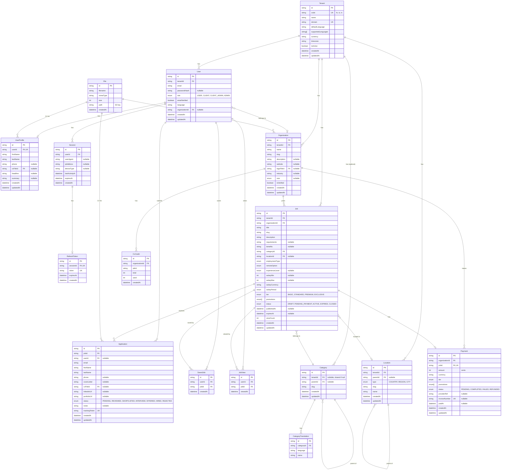

# Entity Relationship Diagram

## Entity Summary

| Entity | Description |
|--------|-------------|
| **Tenant** | Country-specific platform instance |
| **User** | End user (job seeker) or client (employer) |
| **UserProfile** | Extended profile for job seekers |
| **Session** | Active login session with device/IP tracking |
| **RefreshToken** | JWT refresh token tied to a session |
| **Organization** | Employer company/organization |
| **Job** | Job listing posted by organization |
| **Application** | Job application (anonymous or registered) |
| **JobView** | Tracks job views by registered users |
| **Category** | Job category (hierarchical, translatable) |
| **Location** | Geographic location (hierarchical, per tenant) |
| **Payment** | Payment record for job posting |
| **File** | Uploaded files (CVs, logos) |

## Key Relationships

- **Tenant → Everything**: All data is tenant-scoped
- **User → Sessions**: One user can have multiple active sessions
- **Session → RefreshToken**: Each session has one refresh token (cascade delete)
- **User ↔ Organization**: Clients belong to organizations (optional)
- **Organization → Jobs**: One org can post many jobs
- **Job → Applications**: One job receives many applications
- **Application → User**: Optional link (supports anonymous)
- **Category/Location**: Self-referential for hierarchy
